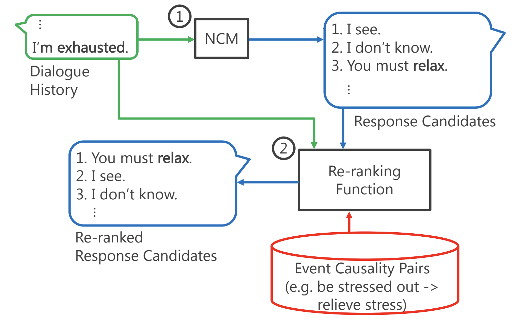
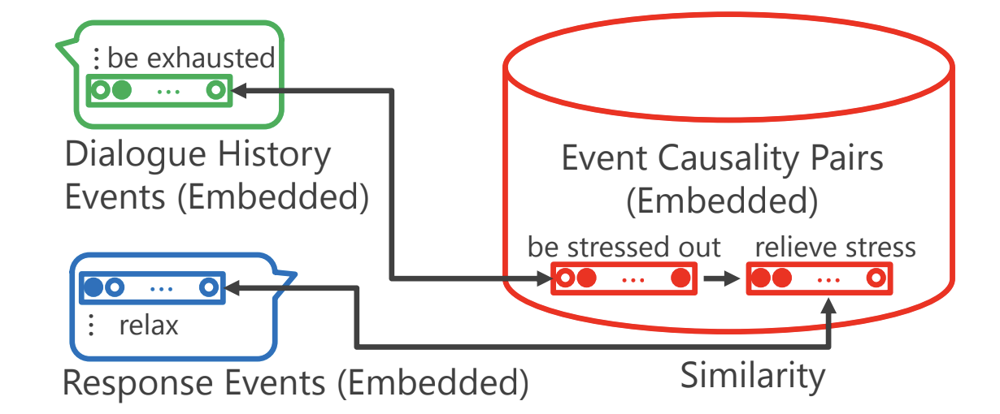
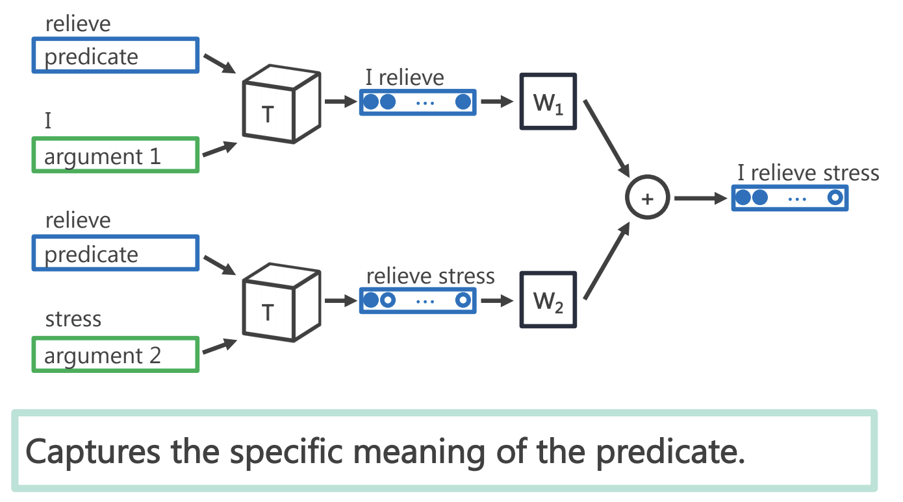

# Conversational Response Re-ranking Based on Event Causality and Role Factored Tensor Event Embedding

https://arxiv.org/pdf/1805.11752.pdf

https://drive.google.com/file/d/1St3ibuqHVja2rWjREr5uaRTg-_7mdLwT/view

### NCM 

Neural Conversaional Model(NCM) - chatbot과 비슷해 보임

답변을 re-ranking해서 가장 적절한 것을 찾아서 내보내겠다는...
이때 과거 정보도 활용

### Event Causality

NCM에서 답변 생성할때 event causality를 활용

Cause-effect relation between two events

eg: be stressed out (cause) -> relieve stress (effect)

### Overview of Re-ranking

1. Generates response candidates from a dialogue history.
2. Gives higher scores to response candidates that have event causality relations to the dialogue history.

### Event Causality Pairs

Each evnt consists of a predicate and arguments.

Predicate: Required
Argument: Optional

### Coverage Problem of Event Causality Pairs

Event causality pairs do not include all causalities in dialogue because they are obtained from limited Web corpus.

=> An event in the dialogue (“relax”) can not be found if it is not included in the pairs.

### Matching Based on Event Embedding

Finds a similar event causality pair on vector space.

### Role Factored Tensor Model (RFTM)

Converts events to distributed representations based on the relationship between a predicate and arguments.

