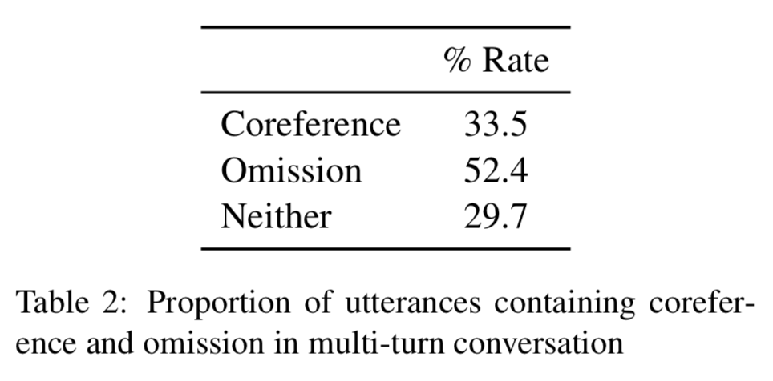
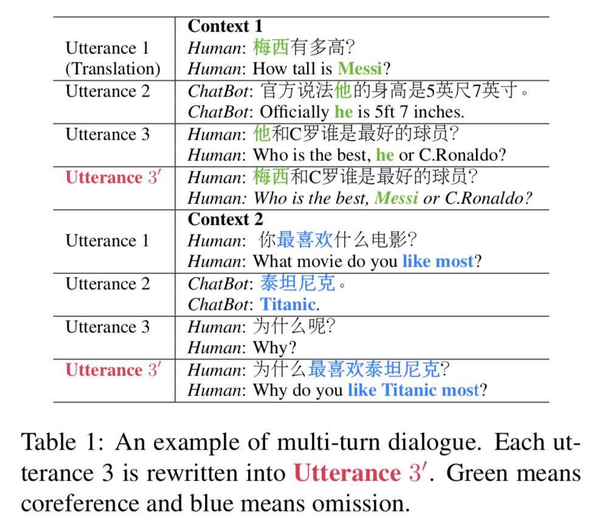
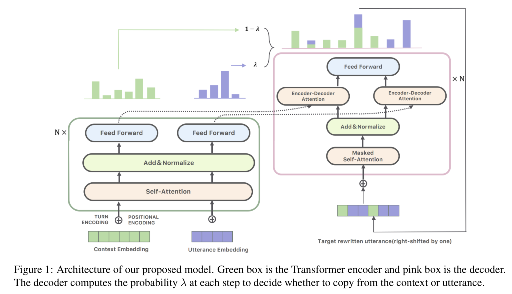
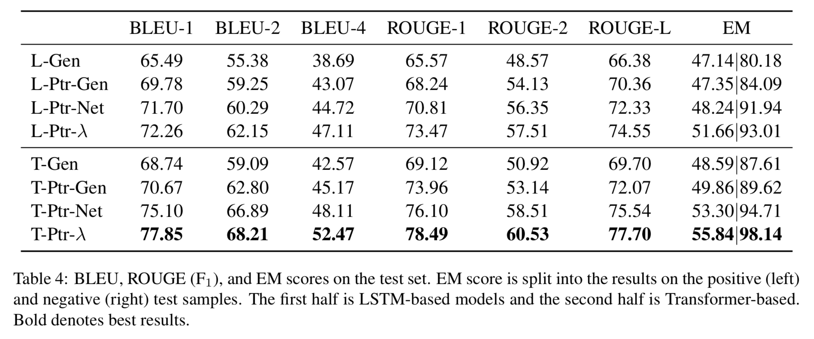
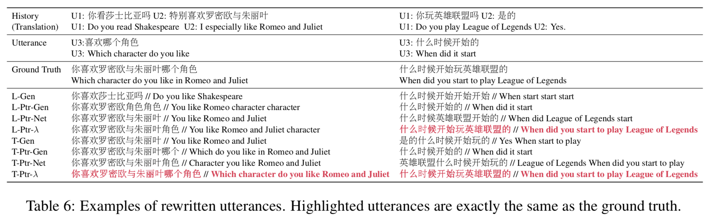
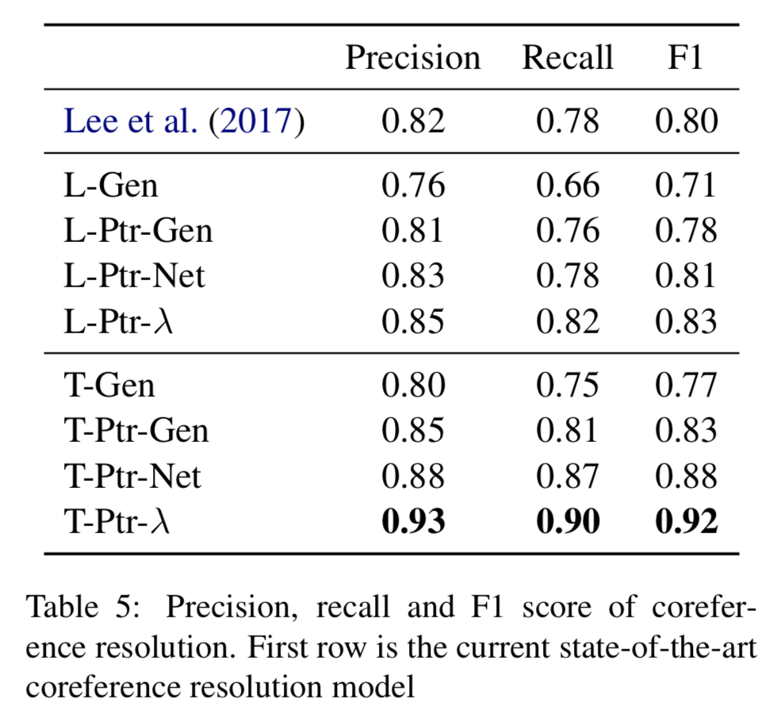
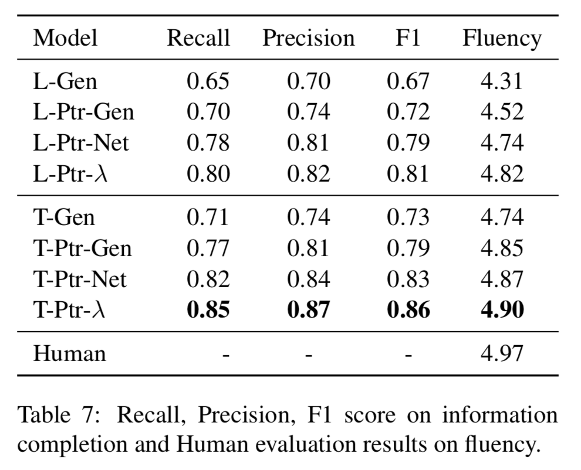
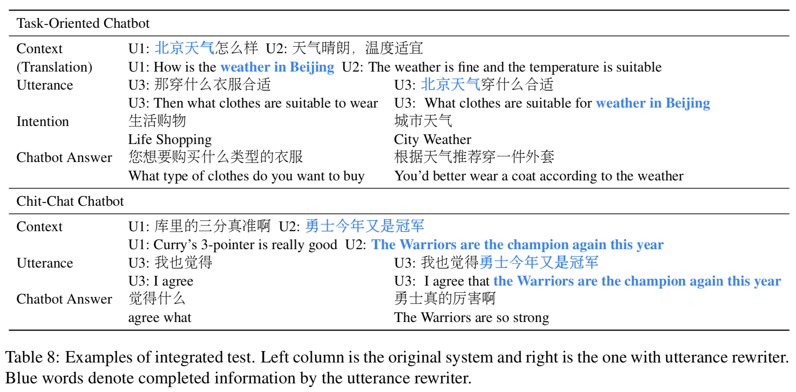
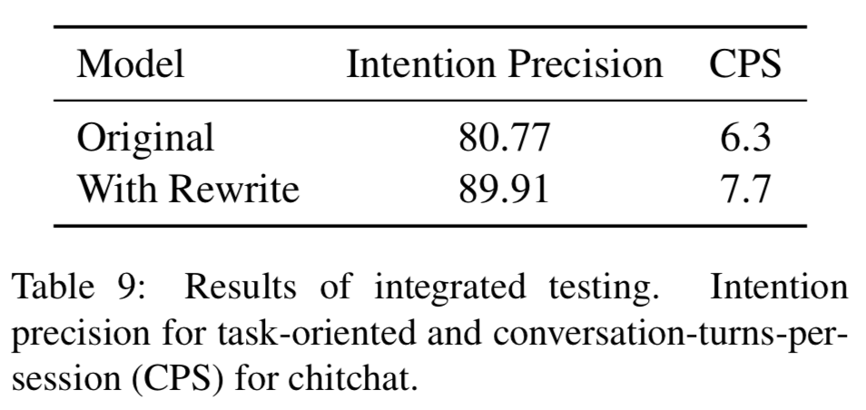

# Improving Multi-turn Dialogue Modelling with Utterance ReWriter 

Paper: https://arxiv.org/pdf/1906.07004.pdf

## Sentence Rewriting
In machine translation, people have used *sentence rewriting* to refine the output generations from seq2seq models.

In text summarization, reediting the retrieved candidates can provide more accurate and abstractive summaries.

In dialogue modelling, Weston et al. (2018) applied it to rewrite outputs from a retrieval model.

Rewriting the source input into some easy-to-process standard format has also gained significant improvements in information retrieval (Riezler and Liu, 2010), semantic parsing (Chen et al., 2016) or question answering (Abujabal et al., 2018) 

but most of them adopt a simple dictionary or template based rewriting strategy. 

## Coreference Resolution 
Coreference resolution aims to link an antecedent for each possible mention. 

Lee et al. (2017) reported state-of-the-art results with an end-to-end neural coreference resolution system. 
=> However, it requires computing the scores for all possible spans, which is computationally inefficient on online dialogue systems. 

## Model에서
Transformer사용

# Dataset
To get parallel training data for the sentence rewriting, **we crawled 200k candidate multi-turn conversational data from several popular Chinese social media platforms for human annotators to work on**. 

참고)
*Coreference resolution* 동일 지시어 분석
*Omission* 생략

### all hidden information
In the annotation process, human annotators need to identify these two situations then rewrite the utterance to cover all hidden information. 

Apart from the accuracy examination, the project manage is also required to 

(1) select topics that are more likely to be talked about in daily conversations, 
(2) try to cover broader domains and 
(3) balance the proportion of different coreference and omission patterns. 

## Model
### Problem Formalization

$(H, U_n \rightarrow R)$

where $H=\{U_1, U_2, \cdots, U_{n-1}\}$ represents the dialogue history containing the first $n−1$ turn of utterances. 

$U_n$ is the nth turn of utterance, the one that needs to be rewritten. 

$R$ is the rewritten utterance after recovering all coreferenced and omitted information in $U_n$. => $R$ could be identical to Un if no coreference or omission is detected (negative sample). 

Our goal is to learn a mapping function $p(R | (H, Un))$ .

**The process is to first encode $(H, U_n)$ into s sequence of vectors, then decode $R$ using the pointer network.** 

### Encoder

We unfold all tokens in $(H,U_n)$ into $(w_1, w_2, \cdots, w_m)$. $m$ is the number of tokens in the whole dialogue. An end-of-turn delimiter is inserted between each two turns. 

The unfolded sequence of tokens are then **encoded with Transformer**. 

We concatenate all tokens in $(H,U_n)$ as the input 

For each token $w_i$, the input embedding is the sum of 

(1) its word embedding, : $WE(w_i)$
(2) position embedding  : $PE(w_i)$
(3) and turn embedding : $TE(w_i)$

$I(w_i) = WE(w_i) + PE(w_i) + TE(w_i) $

where $I(w_i)$ is the input embedding.

The word embedding $WE(w_i)$ and position embedding $PE(w_i)$ are the same as in normal Transformer architectures (Vaswani et al., 2017). 

Tokens from the same turn will share the same turn embedding.

$L$ stacked encoders

Each encoder contains a self-attention layer followed by a feedforward neural network.

$\bold{E}^{(0)}=\left[ I(w_1),I(w_2),\cdots,I(w_m) \right]$

$\bold{E}^{(l)}=\mathrm{FNN}(\mathrm{MultiHead}(\bold{E}^{(l-1)},\bold{E}^{(l-1)},\bold{E}^{(l-1)}))$

The final encodings are the output from the $L$th encoder $E(L)$.

### Decoder

The decoder also contains $L$ layers. The first sub-layer is a multi-head self-attention.

$\bold{M}^l = \mathrm{MultiHead} (\bold{D}^{(l-1)}, \bold{D}^{(l-1)}, \bold{D}^{(l-1)})$

$\bold{D}^{(0)}=R$

The second sub-layer is encoder-decoder attention that integrates $E^{(L)}$ into the decoder.

The encoded sequence $E^{(L)}$ obtained from the last section is split into $E^{(L)}_H$ (encodings of tokens from $H$) and $E^{(L)}_{U_n}$ (encodings of tokens from $U_n$)  then processed separately.

$\bold{C}(H)^l = \mathrm{MultiHead}(\bold{M}^{(l)}, \bold{E}^{(L)}_{H}, \bold{E}^{(L)}_{H})$

$\bold{C}(U_n)^l = \mathrm{MultiHead}(\bold{M}^{(l)}, \bold{E}^{(L)}_{U_n}, \bold{E}^{(L)}_{U_n})$

The third sub-layer is a position-wise fully connected feed-forward neural network:

$\bold{D}^{(l)}=\mathrm{FNN}\left(\left[ \bold{C}(H)^l \circ \bold{C}(U_n)^l \right]\right)$

where $\circ$ denotes vector concatenation.

## Output Distribution?

$p(R_t=w|H, U_n, R_{<t})=\lambda \sum_{i:(w_i = w) \wedge (w_i \in H)}􏰂 a_{t,i}+(1−\lambda) \sum_{j:(w_j = w) \wedge (w_j \in U_n)}􏰂 a^{′}_{t,j}$

$a = \mathrm{Attention}\left(\bold{M}^{(L)}, \bold{E}^{(L)}_{U_n}\right)$

$a' = \mathrm{Attention}\left(\bold{M}^{(L)}, \bold{E}^{(L)}_{H}\right)$

$\lambda=\sigma\left(\bold{w}_{d}^{\top} \bold{D}^{L}_{t} + \bold{w}^{\top}_{H} \bold{C}(H)^{L}_{t}+\bold{w}^{\top}_{U}\bold{C}(U_n)^L_{t} \right)$

where

(1) $a$ and $a'$ are the attention distribution over tokens in $H$ and $U_n$ respectively.

(2) $\bold{w}_d$, $\bold{w}_H$ and $\bold{w}_{U}$ are parameters to be learned, 

(3) $\sigma$ is the sigmoid function to output a value between 0 and 1.

The gating weight $\lambda$ works like a sentinel to inform the decoder whether to extract information from the dialogue history $H$ or directly copy from $U_n$.

$\lambda$ would be always 1 to copy the original $U_n$ as the output. 

Otherwise $\lambda$ becomes 0 when a coreference or omission is detected.

The whole model is trained end- to-end by maximizing $p(R|H, U_n)$.

## Experiments

we focus on answering the following two questions: 

(1) How accurately our proposed model can perform coreference resolution and information completion respectively and -> both automatic evaluation and hu- man judgement.
(2) How good the trained utterance rewriter is at helping off-the-shelf dialogue systems provide more appropriate responses. -> we integrate our rewriting model to two online dialogue systems and analyze how it affects the human-computer interactions.

In the testing stage, all mod- els decode words by beam search with beam size set to 4.

### Compared Models

(1) whether the self-attention based Transformer architecture is superior to other networks like LSTMs,

(2) whether the pointer-based generator is better than pure generation-based models and

(3) whether it is preferred to split the attention by a coefficient $\lambda$ as in our model.

1. (L/T)-Gen : Pure generation-based model. Words are generated from a fixed vocabulary
2. (L/T)-Ptr-Net : Pure pointer-based model as in Vinyals et al. (2015). Words can only be copied from the input
3. (L/T)-Ptr-Gen : Hybrid pointer+generation model as in See et al. (2017). Words can be either copied from the input or generated from a fixed vocabulary.
4. (L/T)-Ptr-$\lambda$ : Our proposed model which split the attention by a coefficient $\lambda$.

(L/T) denotes the encoder-decoder structure is the LSTM or Transformer.

CF) Pointer Network : https://www.slideshare.net/gyuhyeonNam/study-pointer-networks

Result : 

1) **Transformer-based models lead to significant improvement compare with LSTM-based counterparts.** This implies the self-attention mechanism is helpful in identifying coreferred and omitted information. More analysis on how it helps coreference resolu- tion can be seen in the next section. => Transformer가 LSTM보다 좋아요!!

2) The generation mode does not work well in our setting since all words can be retrieved from either $H$ or $U_n$. **Pointer-based models outperform the more complex generation-based and hybrid ones.** => Pointer기반 모델이 기존 복잡한 생성모델보다 최고야!!

3) **Seperately processing $H$ and $U_n$ then combine their attention with a learned $\lambda$ performs better than treating the whole dialogue tokens as a single input**, though the improvement is less significant compared with previous two mentions. => 어텐션 좋아!!

Positive Sample : ReWriting할 수 있음

Negative Sample : ReWriting할 필요가 없는 것

Result of Sentence ReWriting - Coreference Resolution

Result of Sentence ReWriting - Information Completion

- Similar as coreference resolution, we evaluate the quality of information completeness separately.
- One omitted information is considered as properly completed if the rewritten utterance recovers the omitted words.
- Three participants were asked to judge whether the rewritten utterance is a fluent sentence with the score 1(not fluent)-5(fluent).

### Integration Testing

* CPS(conversation-turns-per-session) 

  

